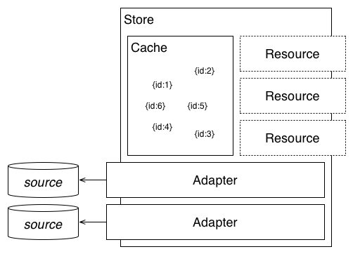

# What is JSData

# Demo App

1. paging support easy to add (but not automatic)
2. relations are fully supported
3. angular selects are easy and use locally cached lists
4. updates are reflected to the one shared model in real time
    * tricky to work around this, actually
5. API to revert unsaved changes
6. API to save changes

# Code Walkthrough

1. Server Side
    1. set up JSData store (server.coffee / server_schema.coffee)
    2. define models (composers.coffee / works.coffee)
    3. using the model (routes.coffee)
2. Client Side
    1. set up the JSData store (client.coffee / client_schema.coffee)
    2. define models (same as server!)
    3. base controllers (base_controllers.coffee / composer.coffee)
    4. editing models (editor.coffee / work.coffee)

# Questions

1. Do you need to save each model individually, or do parents save children automatically?
